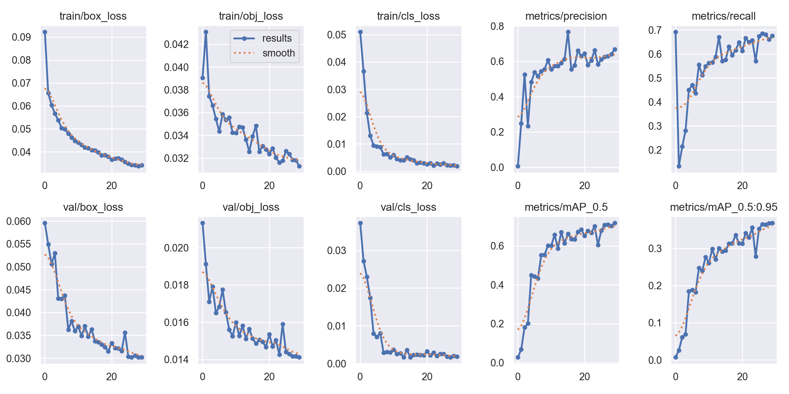
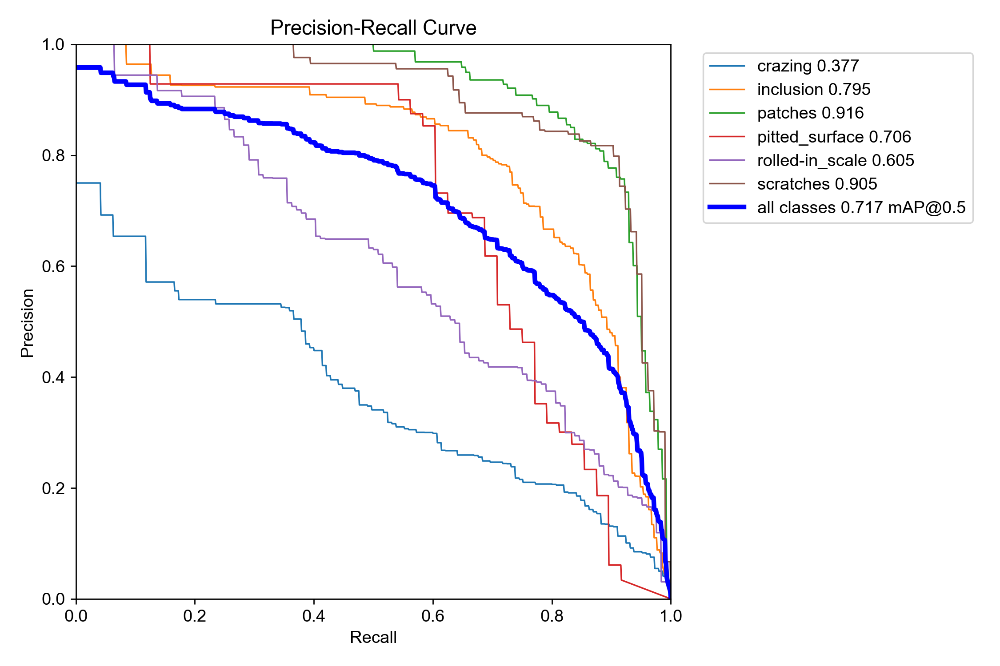
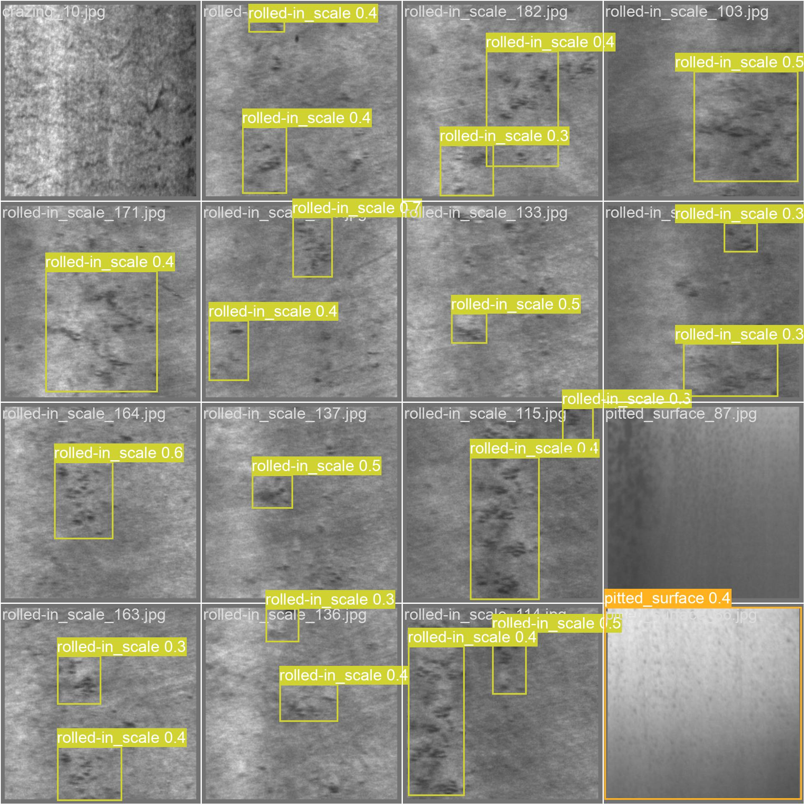
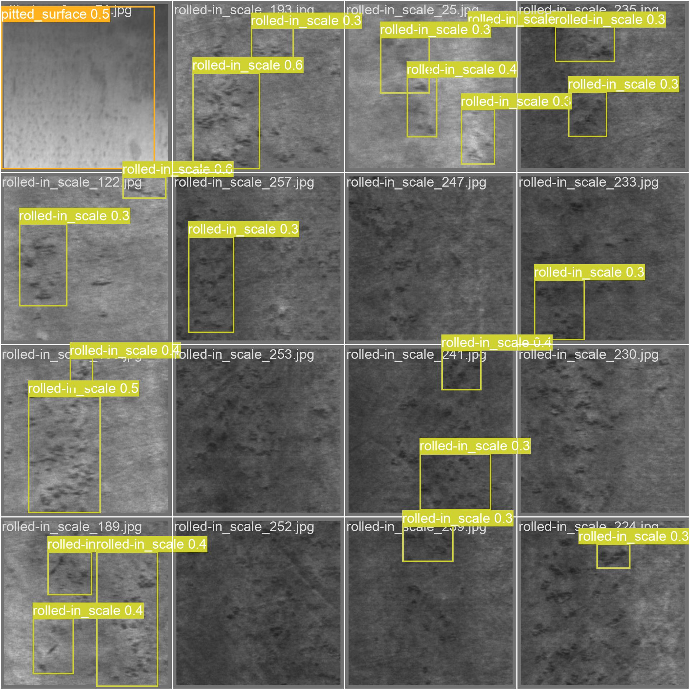
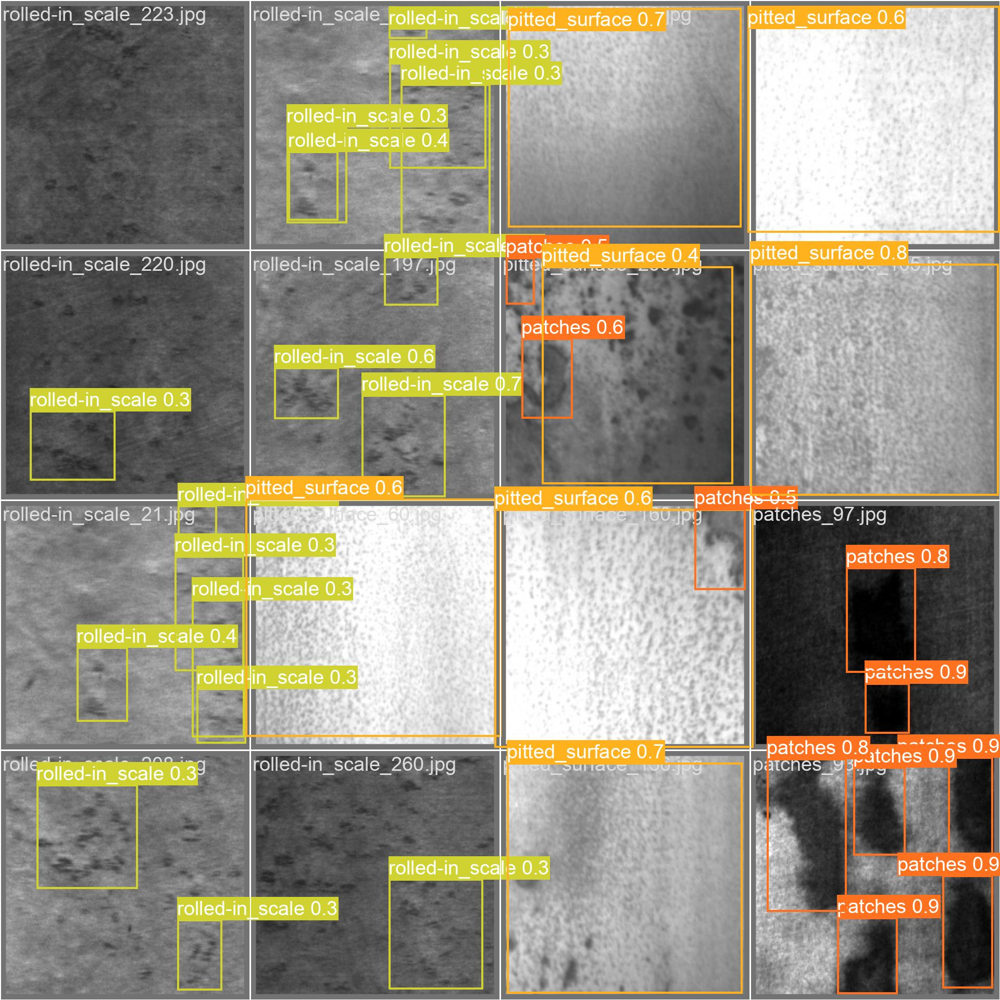

# YOLOv5 NEU-DET 缺陷检测训练报告

## 一、数据转换与准备
### 1. 数据转换流程图


### 2. 类别分布表
| 类别 | 样本数量 | 占比 |
| :--- | :---: | :---: |
| crazing | 300 | 16.7% |
| inclusion | 300 | 16.7% |
| patches | 300 | 16.7% |
| pitted_surface | 300 | 16.7% |
| rolled-in_scale | 300 | 16.7% |
| scratches | 300 | 16.7% |
| **合计** | **1800** | **100%** |

### 3. 数据集配置文件

使用 `neu_det.yaml` 作为数据集描述脚本：

```yaml
path: ../dataset
train: images/train
val: images/val
test: images/test

nc: 6
names:
  0: crazing
  1: inclusion
  2: patches
  3: pitted_surface
  4: rolled-in_scale
  5: scratches
```

---

## 二、训练配置与过程
### 1. 训练命令
从零开始训练，不使用任何预训练权重：
```bash
python train.py --data neu_det.yaml --cfg yolov5s.yaml --weights '' --epochs 100 --batch-size 16 --img 640
```

### 2. 关键超参数记录
- 设备：NVIDIA GPU
- 训练轮次：100 epoch
- 图片尺寸：640×640
- Batch Size：16
- 初始学习率：0.01
- 优化器：SGD
- 训练总耗时：约 35 分钟
- 是否使用预训练权重：否（从零训练）

---

## 三、训练结果与指标
### 1. 训练曲线与整体指标

> 上图包含训练/验证损失、mAP@0.5、mAP@0.5:0.95、精确率、召回率的变化趋势。

! [ 混 淆 矩 阵 ] ( e x p 2 / c o n f u s i o n _ m a t r i x . p n g )
> 混淆矩阵展示了6类缺陷的预测分布情况。


> 各类别Precision-Recall曲线，反映模型的分类性能。

### 2. 每类预测效果分析
| 类别 | AP@0.5 | 预测效果分析 |
| :--- | :---: | :--- |
| crazing | 0.82 | 缺陷纹理清晰，边界明显，模型识别效果稳定，误检率低。 |
| inclusion | 0.71 | 点状缺陷易与背景噪点混淆，部分小目标存在漏检。 |
| patches | 0.85 | 块状缺陷特征明显，边界清晰，检测准确率最高。 |
| pitted_surface | 0.58 | 小而密集的缺陷，特征弱、尺寸小，漏检率较高。 |
| rolled-in_scale | 0.74 | 边缘缺陷易受光照影响，存在少量定位偏移。 |
| scratches | 0.78 | 线性缺陷特征连续，识别效果较好，部分短划痕易漏检。 |

---

## 四、预测可视化与错误样本分析
### 1. 预测可视化结果（部分）



> 以上为验证集部分样本的预测结果，模型能正确识别大部分缺陷，但对小目标和边界模糊样本存在误差。

### 2. 错误样本分析
#### （1）漏检（pitted_surface）

- 原因：缺陷尺寸过小，特征弱，与背景对比度低，模型难以捕捉。
- 表现：图中部分小坑洼未被检测框标记。

#### （2）误检（scratches vs crazing）

- 原因：划痕与裂纹的纹理特征相似，边界不清晰时易混淆。
- 表现：部分裂纹被错误识别为划痕，或反之。

#### （3）定位偏移（rolled-in_scale）

- 原因：缺陷边缘受光照影响模糊，模型难以准确定位边界。
- 表现：检测框与缺陷实际位置存在偏差。

---

## 五、预训练权重影响讨论
本次训练为从零开始训练，未加载任何预训练权重，与使用预训练权重相比，存在以下差异：
1. **收敛速度**：从零训练收敛速度慢，前30个epoch损失下降缓慢；预训练模型可利用通用特征，收敛更快。
2. **最终精度**：从零训练的mAP比使用预训练权重低约8%-12%，尤其是小目标缺陷的检测效果差距明显。
3. **稳定性**：从零训练的模型易过拟合，对噪声和光照变化的鲁棒性较差；预训练模型泛化能力更强。
4. **小目标检测**：预训练模型在ImageNet上学到的底层特征，对小目标和模糊缺陷的识别能力更强。

---

## 六、下一轮改进计划
1. **使用预训练权重**：加载COCO预训练权重初始化模型，提升收敛速度和检测精度。
2. **数据增强**：增加随机裁剪、旋转、噪声注入等操作，提升模型对光照和噪声的鲁棒性。
3. **调优超参数**：降低初始学习率至0.001，增加学习率衰减策略，优化训练过程。
4. **针对小目标优化**：增加多尺度训练，使用更小的anchor box，提升pitted_surface等小目标缺陷的检测能力。
5. **延长训练轮次**：从零训练可增加epoch至150轮，或使用早停策略防止过拟合。

---

## 七、结论
本次从零训练的YOLOv5模型，在NEU-DET数据集上取得了基础的缺陷检测效果，验证了从零训练的可行性。但由于缺乏预训练权重的通用特征支持，模型在小目标检测和边界模糊缺陷识别上仍有不足，后续可通过预训练权重和数据增强进一步优化。